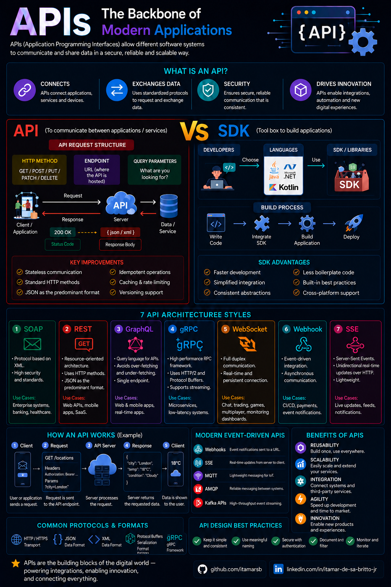
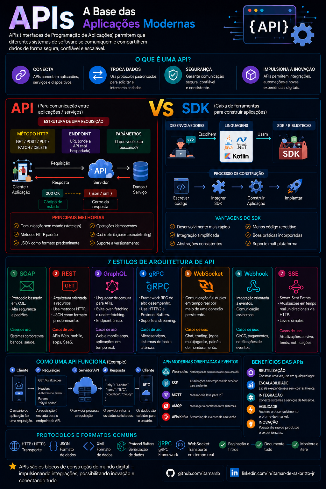
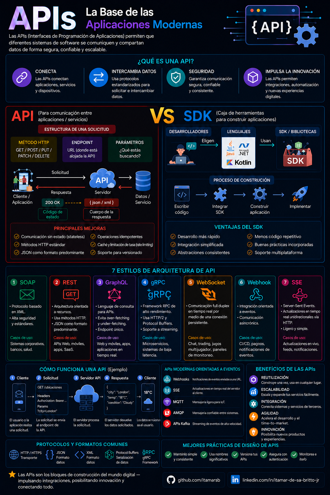

# API Engineering Lab — Learning Roadmap

This roadmap presents a progressive journey through API fundamentals, professional development, testing, multiple frameworks, delivery practices and complete API projects.

Each lab builds a practical API for a different business scenario, introducing new concepts and technologies while reinforcing previously acquired skills.

## Overall Progress

**Completed:** 0 / 18 Labs

### Status Legend

- ⬜ Planned
- 🟨 In Progress
- ✅ Completed

### Level Legend

- 🟢 Fundamentals
- 🟡 Intermediate
- 🟠 Testing
- 🔵 Multi-Framework
- 🔴 Delivery
- 🟣 Consolidated Project

---

---

## 🟢 Phase 1 — API Fundamentals

Build a solid foundation in HTTP, REST, JSON, resource modeling, validation and error handling.

| Status | Lab | Level | API Project | Business Scenario | Main Concepts | Technologies | Skills Demonstrated |
|:---:|:---:|:---:|---|---|---|---|---|
| ⬜ | 01 | 🟢 | Weather API | Public Weather Service | HTTP, REST, JSON, Routing, Query Parameters | Python, FastAPI | REST Design, Routing, Responses |
| ⬜ | 02 | 🟢 | Library Management API | University Library | CRUD, Resources, HTTP Methods, Status Codes | Python, FastAPI | Resource Modeling, CRUD Operations |
| ⬜ | 03 | 🟢 | Inventory API | Retail Inventory | Schemas, Validation, Error Handling | Python, FastAPI, Pydantic | Input Validation, Standardized Errors |

---

---

## Overview by Infographics:

### English

### Português (Brasil)

### Español (España)

