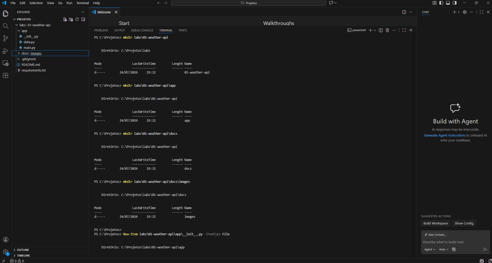
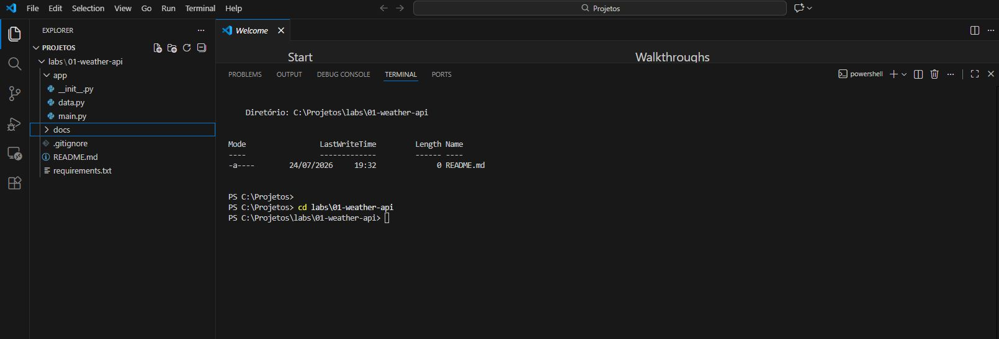
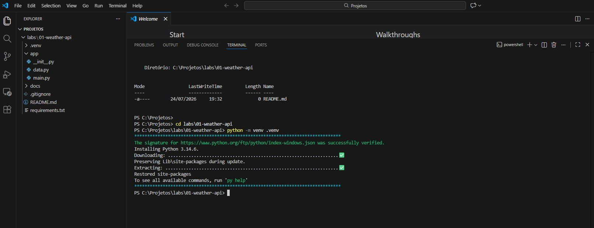

# Lab 01 — Weather API

### Scope of this first version

We will implement four endpoints:

```http
GET /
GET /health
GET /weather
GET /weather/{city}
```

They will demonstrate:

- creating a FastAPI application;
- HTTP GET operations;
- JSON responses;
- path parameters;
- query parameters;
- HTTP status codes;
- handling non-existent cities;
- automatic documentation with Swagger UI and ReDoc;
- local execution;
- manual testing via browser, Swagger, PowerShell, and Postman.

FastAPI automatically distinguishes between parameters present in the path and those received in the query string. Type annotations are also used for conversion, validation, and OpenAPI contract generation.

---

## 1. Laboratory structure

Within the repository, we will create:

```text
api-engineering-lab/
│
├── labs/
│   └── 01-weather-api/
│       ├── app/
│       │   ├── __init__.py
│       │   ├── data.py
│       │   └── main.py
│       │
│       ├── docs/
│       │   └── images/
│       │
│       ├── .gitignore
│       ├── README.md
│       └── requirements.txt
│
└── README.md
```

For Lab 01, this structure offers a good balance: it is small enough to grasp (especially if you are a beginner following the tutorial in this repository), yet it avoids concentrating the entire project into a single file.

---

## 2. Create the lab folder

In the VS Code integrated terminal, run the following from the repository root:

### PowerShell

```powershell
mkdir labs\01-weather-api
mkdir labs\01-weather-api\app
mkdir labs\01-weather-api\docs
mkdir labs\01-weather-api\docs\images

New-Item labs\01-weather-api\app\__init__.py -ItemType File
New-Item labs\01-weather-api\app\data.py -ItemType File
New-Item labs\01-weather-api\app\main.py -ItemType File
New-Item labs\01-weather-api\requirements.txt -ItemType File
New-Item labs\01-weather-api\.gitignore -ItemType File
New-Item labs\01-weather-api\README.md -ItemType File

cd labs\01-weather-api
```

It is also possible to create these folders manually using the VS Code Explorer.



AND




---


## 3. Create the virtual environment

Inside `labs/01-weather-api`, run:

```powershell
python -m venv .venv
```

The `venv` creates an isolated environment so that the lab's dependencies do not mix with global packages or other Python projects. The name `.venv` is a common convention for this directory.




Activate the environment:

```powershell
.venv\Scripts\Activate.ps1
```

When active, the terminal should display something similar to:

```powershell
(.venv) PS C:\...\api-engineering-lab\labs\01-weather-api>
```

However, if PowerShell blocks the activation, run it only for the current session:

```powershell
Set-ExecutionPolicy -Scope Process -ExecutionPolicy Bypass
```

Then, try again:

```powershell
.venv\Scripts\Activate.ps1
```

