# Lab 01 — Weather API

### Scope of this first version

We will implement four endpoints:

```http
GET /
GET /health
GET /weather
GET /weather/{city}
```

They will demonstrate:

- creating a FastAPI application;
- HTTP GET operations;
- JSON responses;
- path parameters;
- query parameters;
- HTTP status codes;
- handling non-existent cities;
- automatic documentation with Swagger UI and ReDoc;
- local execution;
- manual testing via browser, Swagger, PowerShell, and Postman.

FastAPI automatically distinguishes between parameters present in the path and those received in the query string. Type annotations are also used for conversion, validation, and OpenAPI contract generation.

---

## 1. Laboratory structure

Within the repository, we will create:

```text
api-engineering-lab/
│
├── labs/
│   └── 01-weather-api/
│       ├── app/
│       │   ├── __init__.py
│       │   ├── data.py
│       │   └── main.py
│       │
│       ├── docs/
│       │   └── images/
│       │
│       ├── .gitignore
│       ├── README.md
│       └── requirements.txt
│
└── README.md
```

For Lab 01, this structure offers a good balance: it is small enough to grasp (especially if you are a beginner following the tutorial in this repository), yet it avoids concentrating the entire project into a single file.

---

## 2. Create the lab folder

In the VS Code integrated terminal, run the following from the repository root:

### PowerShell

```powershell
mkdir labs\01-weather-api
mkdir labs\01-weather-api\app
mkdir labs\01-weather-api\docs
mkdir labs\01-weather-api\docs\images

New-Item labs\01-weather-api\app\__init__.py -ItemType File
New-Item labs\01-weather-api\app\data.py -ItemType File
New-Item labs\01-weather-api\app\main.py -ItemType File
New-Item labs\01-weather-api\requirements.txt -ItemType File
New-Item labs\01-weather-api\.gitignore -ItemType File
New-Item labs\01-weather-api\README.md -ItemType File

cd labs\01-weather-api
```

It is also possible to create these folders manually using the VS Code Explorer.


AND


---


## 3. Create the virtual environment

Inside `labs/01-weather-api`, run:

```powershell
python -m venv .venv
```

The `venv` creates an isolated environment so that the lab's dependencies do not mix with global packages or other Python projects. The name `.venv` is a common convention for this directory.


Activate the environment:

```powershell
.venv\Scripts\Activate.ps1
```

When active, the terminal should display something similar to:

```powershell
(.venv) PS C:\...\api-engineering-lab\labs\01-weather-api>
```

However, if PowerShell blocks the activation, run it only for the current session:

```powershell
Set-ExecutionPolicy -Scope Process -ExecutionPolicy Bypass
```

Then, try again:

```powershell
.venv\Scripts\Activate.ps1
```


---


## 4. Install FastAPI

Populate the `requirements.txt` file with:

```text
fastapi[standard]
```


Then run:

```powershell
python -m pip install --upgrade pip
pip install -r requirements.txt
```

The `fastapi[standard]` installation includes the standard dependencies required to run the application and provides the FastAPI CLI. Current documentation recommends working within a virtual environment and running the application in development mode using `fastapi dev`.


Once we confirm that everything is working, we can pin the installed versions:

```powershell
pip freeze > requirements.txt
```

This makes future execution more reproducible. The FastAPI documentation itself recommends pinning a version that has been validated by the project, especially before evolving or publishing the application.


> [!TIP]
> **Note:**
>
> If you are new to FastAPI, I suggest you take some time to review the official FastAPI documentation (at the link below), as there is no better material for learning any technology than the official documentation provided by the developers themselves:
>
> https://fastapi.tiangolo.com/
> 


---


## 5. Create the simulated weather data

In the file:

```text
app/data.py
```

add:

```python
"""Simulated weather data used by the Weather API."""

WEATHER_DATA: dict[str, dict[str, object]] = {
    "rio-grande": {
        "city": "Rio Grande",
        "state": "RS",
        "country": "Brazil",
        "temperature_c": 16.5,
        "condition": "Partly cloudy",
        "humidity_percent": 82,
        "wind_speed_kmh": 21.0,
    },
    "porto-alegre": {
        "city": "Porto Alegre",
        "state": "RS",
        "country": "Brazil",
        "temperature_c": 19.8,
        "condition": "Cloudy",
        "humidity_percent": 76,
        "wind_speed_kmh": 13.0,
    },
    "orlando": {
        "city": "Orlando",
        "state": "FL",
        "country": "United States",
        "temperature_c": 30.2,
        "condition": "Sunny",
        "humidity_percent": 68,
        "wind_speed_kmh": 11.0,
    },
    "tampa": {
        "city": "Tampa",
        "state": "FL",
        "country": "United States",
        "temperature_c": 31.0,
        "condition": "Scattered clouds",
        "humidity_percent": 72,
        "wind_speed_kmh": 15.0,
    },
}
```

This data is deliberately simulated. We will not need:

- an API key;
- registration with an external service;
- an internet connection;
- handling of request limits;
- third-party dependencies.


The goal of this lab is to learn the structure and behavior of an API, not to integrate a real weather provider. That type of integration will be demonstrated later in another lab.


---


## 6. Build the application

In the file:

```text
app/main.py
```

add:

```python
"""Lab 01 - Weather API.

A small FastAPI application created to demonstrate HTTP, REST, JSON,
routing, path parameters, query parameters and automatic API documentation.
"""

from typing import Annotated, Literal

from fastapi import FastAPI, HTTPException, Path, Query, status

from app.data import WEATHER_DATA


app = FastAPI(
    title="Weather API",
    description=(
        "An introductory REST API that returns simulated weather data "
        "for selected cities."
    ),
    version="1.0.0",
    contact={
        "name": "Itamar de Sá Britto Júnior",
        "url": "https://github.com/itamarsb",
    },
    license_info={
        "name": "MIT",
    },
)


def normalize_city(city: str) -> str:
    """Convert a city name into the key format used by the dataset."""

    return city.strip().lower().replace(" ", "-")


@app.get(
    "/",
    tags=["General"],
    summary="Display API information",
)
async def root() -> dict[str, str]:
    """Return basic information and documentation links."""

    return {
        "name": "Weather API",
        "version": "1.0.0",
        "description": "Simulated weather data for API learning.",
        "documentation": "/docs",
        "alternative_documentation": "/redoc",
        "health_check": "/health",
    }


@app.get(
    "/health",
    tags=["General"],
    summary="Check API availability",
)
async def health_check() -> dict[str, str]:
    """Return the current operational status of the API."""

    return {
        "status": "healthy",
        "service": "weather-api",
        "version": "1.0.0",
    }


@app.get(
    "/weather",
    tags=["Weather"],
    summary="List available weather records",
)
async def list_weather(
    unit: Annotated[
        Literal["celsius", "fahrenheit"],
        Query(description="Temperature unit used in the response"),
    ] = "celsius",
) -> dict[str, object]:
    """Return weather information for all available cities."""

    records = [
        convert_temperature(record, unit)
        for record in WEATHER_DATA.values()
    ]

    return {
        "unit": unit,
        "count": len(records),
        "data": records,
    }


@app.get(
    "/weather/{city}",
    tags=["Weather"],
    summary="Get weather by city",
    responses={
        status.HTTP_404_NOT_FOUND: {
            "description": "The requested city was not found."
        }
    },
)
async def get_weather_by_city(
    city: Annotated[
        str,
        Path(
            min_length=2,
            max_length=80,
            description="City name, such as Rio Grande, Orlando or Tampa",
            examples=["Rio Grande"],
        ),
    ],
    unit: Annotated[
        Literal["celsius", "fahrenheit"],
        Query(description="Temperature unit used in the response"),
    ] = "celsius",
) -> dict[str, object]:
    """Return simulated weather information for one city."""

    city_key = normalize_city(city)
    weather = WEATHER_DATA.get(city_key)

    if weather is None:
        raise HTTPException(
            status_code=status.HTTP_404_NOT_FOUND,
            detail={
                "error": "city_not_found",
                "message": f"Weather data is not available for '{city}'.",
                "available_cities": [
                    item["city"] for item in WEATHER_DATA.values()
                ],
            },
        )

    return {
        "unit": unit,
        "data": convert_temperature(weather, unit),
    }


def convert_temperature(
    weather: dict[str, object],
    unit: Literal["celsius", "fahrenheit"],
) -> dict[str, object]:
    """Return a copy of a weather record using the selected unit."""

    result = dict(weather)
    temperature_c = float(result.pop("temperature_c"))

    if unit == "fahrenheit":
        result["temperature"] = round((temperature_c * 9 / 5) + 32, 1)
        result["temperature_unit"] = "°F"
    else:
        result["temperature"] = temperature_c
        result["temperature_unit"] = "°C"

    return result
```


### What this code already demonstrates:

The endpoint:

```http
GET /weather/{city}
```

uses `city` as path parameter:

```http
GET /weather/orlando
```

While `unit` is a query parameter:

```http
GET /weather/orlando?unit=fahrenheit
```

FastAPI identifies these parameters based on the route declaration and the function signature. It also applies validations and includes the information in the OpenAPI documentation.


---


## 7. Create the .gitignore

In the file:

```text
.gitignore
```

add:

```gitignore
# Virtual environment
.venv/
venv/

# Python cache
__pycache__/
*.py[cod]
*$py.class

# Test and coverage artifacts
.pytest_cache/
.coverage
htmlcov/

# Environment variables
.env

# IDE files
.vscode/
.idea/

# Operating system files
.DS_Store
Thumbs.db
```

The `.venv` folder should not be pushed to GitHub. The repository will store dependencies in `requirements.txt`, not a full copy of the Python environment.


---


## 8. Run the API

In the `labs/01-weather-api` folder, with the virtual environment activated:

```powershell
fastapi dev app/main.py
```

The output should indicate a server similar to:

```http
FastAPI  Starting development server

Server started at http://127.0.0.1:8000
Documentation at http://127.0.0.1:8000/docs
```


The `fastapi dev` command is intended for local development and starts the server with automatic reloading.

It is also possible to run it using:

```powershell
uvicorn app.main:app --reload
```

However, we will use `fastapi dev app/main.py` in the tutorial because it is the workflow currently presented in the official documentation.


---


## 9. Test in the browser

Open:

```http
http://127.0.0.1:8000/
```

Expected response:

```json
{
  "name": "Weather API",
  "version": "1.0.0",
  "description": "Simulated weather data for API learning.",
  "documentation": "/docs",
  "alternative_documentation": "/redoc",
  "health_check": "/health"
}
```


Try this too:

```http
http://127.0.0.1:8000/health
```

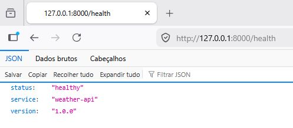


```http
http://127.0.0.1:8000/weather
```

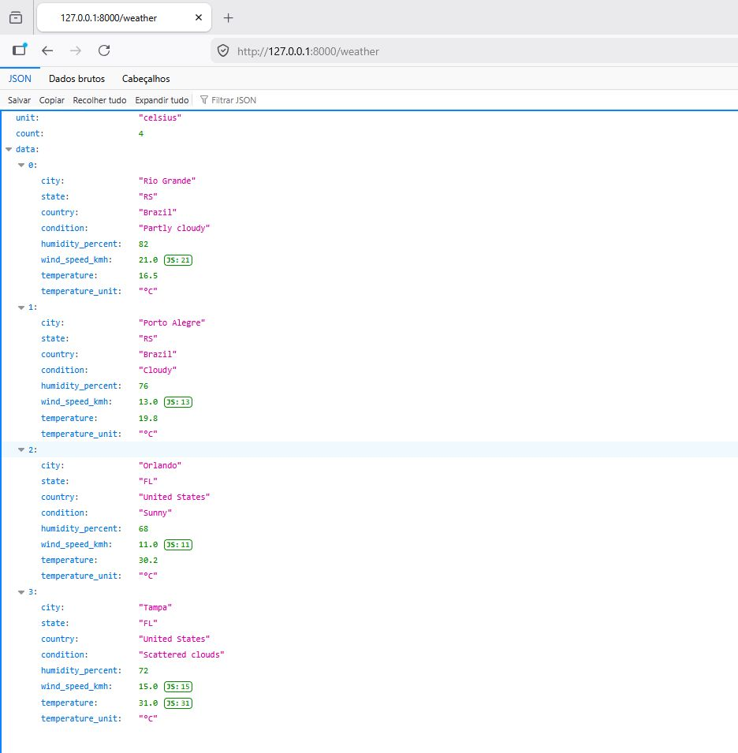


```http
http://127.0.0.1:8000/weather/rio-grande
```

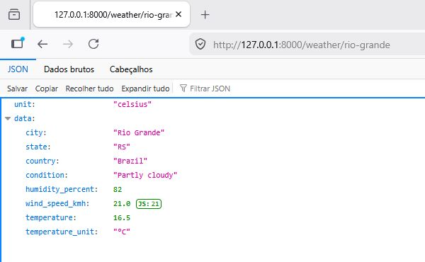


```http
http://127.0.0.1:8000/weather/orlando?unit=fahrenheit
```

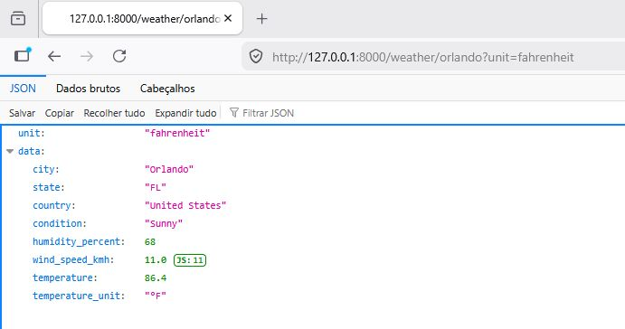


---


## 10. Test an error response

Access a city that does not exist in the dataset:

```http
http://127.0.0.1:8000/weather/chicago
```

Expected response:

```json
{
  "detail": {
    "error": "city_not_found",
    "message": "Weather data is not available for 'chicago'.",
    "available_cities": [
      "Rio Grande",
      "Porto Alegre",
      "Orlando",
      "Tampa"
    ]
  }
}
```

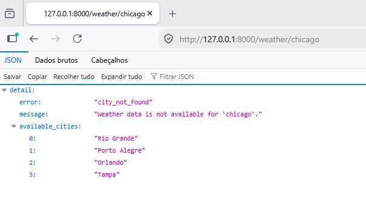


The HTTP code must be:

```http
404 Not Found
```

This is important because an API should not return `200 OK` when the requested resource was not found.

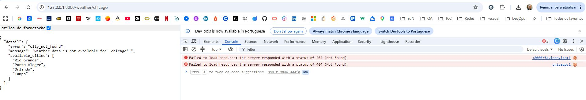


---


## 11. Test automatic validation

Go to:

```http
http://127.0.0.1:8000/weather/orlando?unit=kelvin
```

Since the parameter accepts only:

```text
celsius
fahrenheit
```

FastAPI will return a `422` validation error.

This behavior demonstrates a key advantage of type declarations: the framework automatically converts, validates, and documents the accepted parameters.


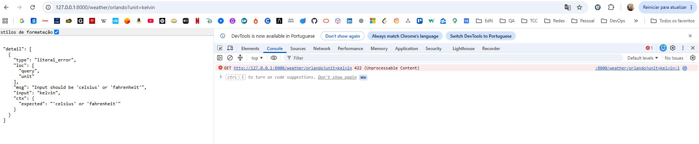


---


## 12. Test using Swagger UI

Swagger UI is simply an interactive interface for testing the API via the browser. You don't need to install anything beyond what you are already using with FastAPI.

### Confirm that the API is running

In the VS Code terminal, inside the lab folder, run:

```bash
uvicorn app.main:app --reload
```

You should receive something similar to:

```text
Uvicorn running on http://127.0.0.1:8000
```

Keep this terminal open. Do not press `Ctrl + C`, as that would terminate the application.


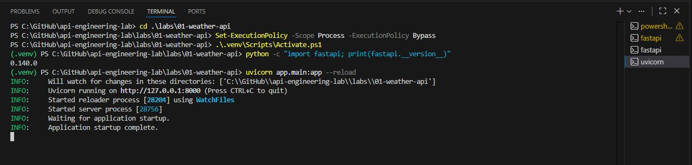


### Open Swagger UI

In Firefox, Chrome, or Edge, go to:

```http
http://127.0.0.1:8000/docs
```

The page will be titled:

```text
Weather API - Swagger UI
```

You will probably see two groups:

- General
- Weather

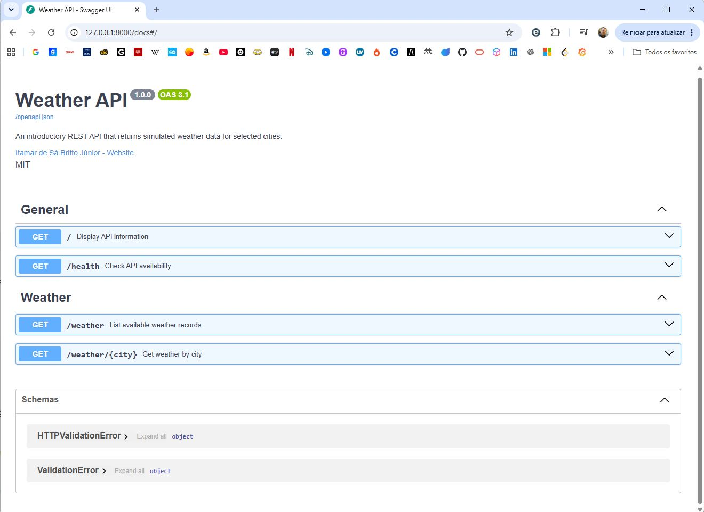


### Open the climate route

Click on the line:

```http
GET /weather/{city}
```

It should expand and display the available parameters.

The `GET` button indicates that this route is used to query information without modifying data.

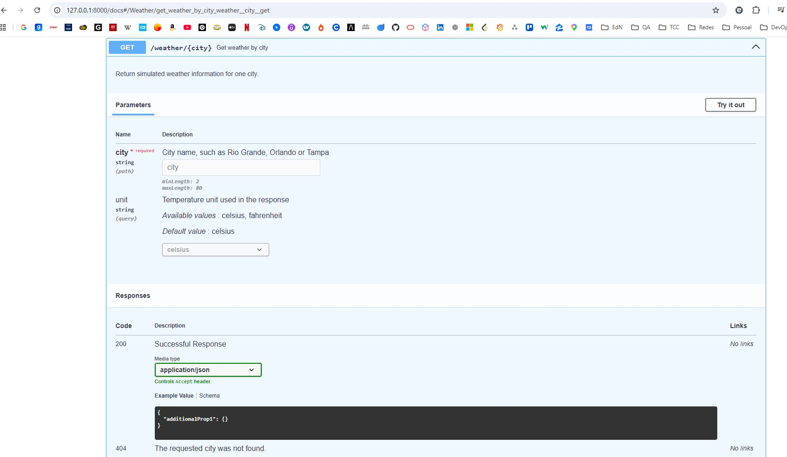


### Click “Try it out”

In the right corner of the expanded route, click:

```text
Try it out
```

The fields, previously blocked, will become available for entry.

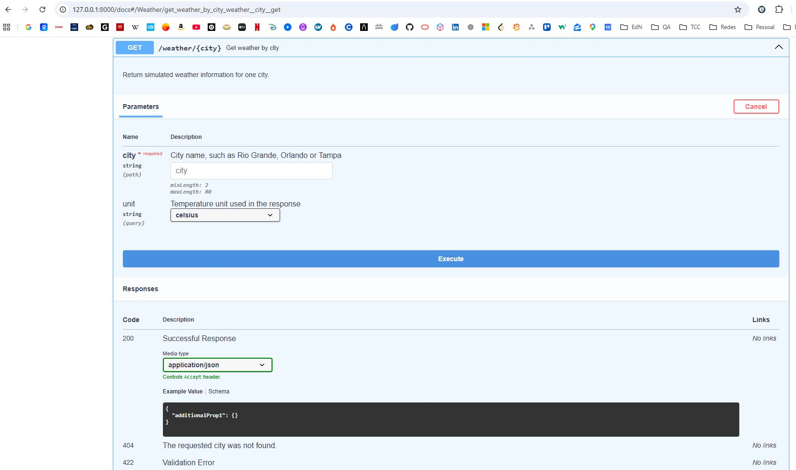


### Fill in the parameters

In the required `city` field, enter:

```text
Rio Grande
```

In the `unit` field, choose or enter:

```text
celsius
```

Depending on how the route was programmed, the `unit` field may appear as:

- a text box;
- a list of options;
- a parameter pre-filled with `celsius`.

Do not enter `city: Rio Grande` in the field. Type only:

```text
Rio Grande
```

Likewise, in the unit field, enter only:

```text
celsius
```

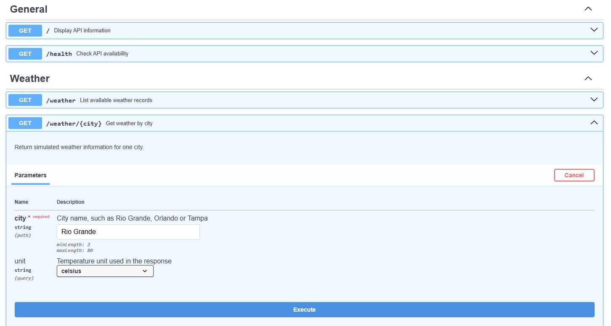


### Click “Execute”

After filling in the fields, click the blue button:

```text
Execute
```

Swagger will construct a request similar to:

```http
GET http://127.0.0.1:8000/weather/Rio%20Grande?unit=celsius
```

The `%20` simply represents the space between `Rio` and `Grande`.

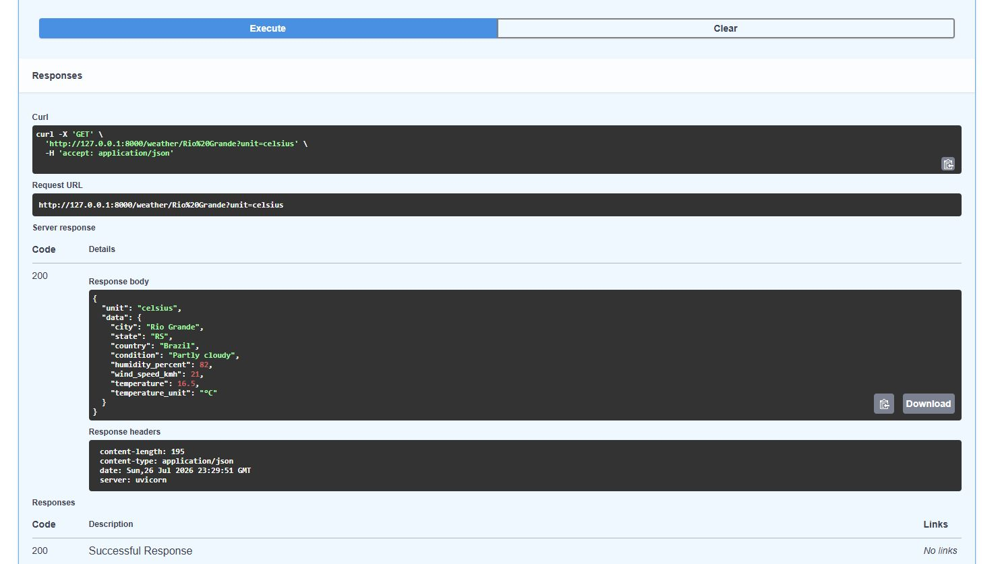


### Check the result

After running it, look for the section:

```text
Server response
```

The most important points are:

### Code

If everything is correct:

```text
200
```

This means that the request was processed successfully.

### Response body

It is the JSON response produced by the API. It may have a format similar to:

```json
{
  "city": "Rio Grande",
  "temperature": 16.5,
  "unit": "celsius",
  "condition": "Partly cloudy"
}
```

The exact content depends on how we build the application.

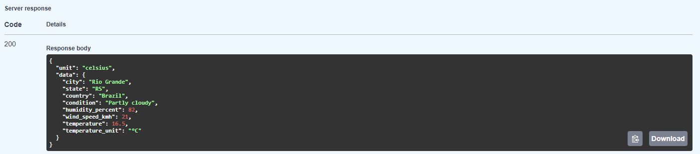


### Request URL

Shows the full address used by Swagger:

```text
http://127.0.0.1:8000/weather/Rio%20Grande?unit=celsius
```

### Curl

Swagger also automatically creates an equivalent command:

```bash
curl -X 'GET' \
  'http://127.0.0.1:8000/weather/Rio%20Grande?unit=celsius' \
  -H 'accept: application/json'
```

This command demonstrates how the same query could be performed via the terminal.


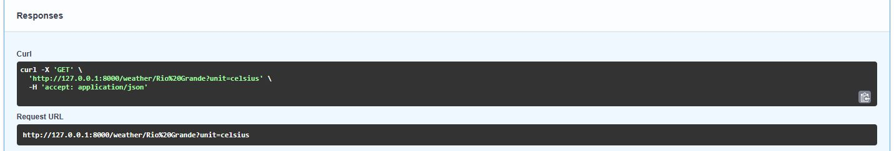


### The complete workflow is this

```text
Terminal with Uvicorn running
            ↓
Open /docs in the browser
            ↓
Expand GET /weather/{city}
            ↓
Try it out
            ↓
Fill in city and unit
            ↓
Execute
            ↓
Check Code and Response body
```


### Additional test to verify the 404 error

After the successful test, you can also open a non-existent route directly in the browser:

```text
http://127.0.0.1:8000/non-existent-route
```

FastAPI should return:

```json
{
  "detail": "Not Found"
}
```

with the HTTP code:

```text
404 Not Found
```


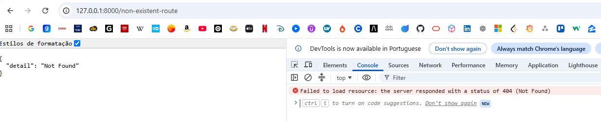


In Swagger, the main test for step 12 is receiving a **200 code** on the `/weather/{city}` route and viewing the JSON in the **Response body**.

If the response is correct, you will see:

- **Code:** `200`
- **Response body:** JSON returned by the API.
- **Request URL:** URL used by Swagger.


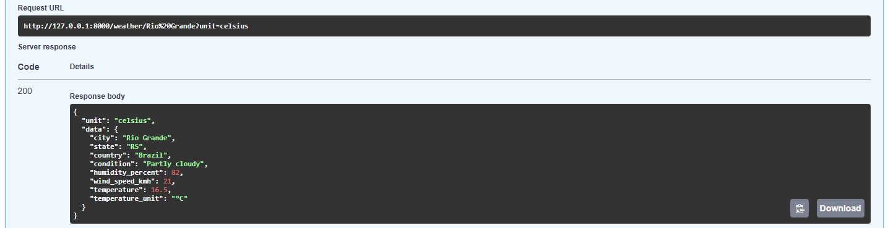


---


### 13. Test using PowerShell

```powershell
Invoke-RestMethod http://127.0.0.1:8000/health
```

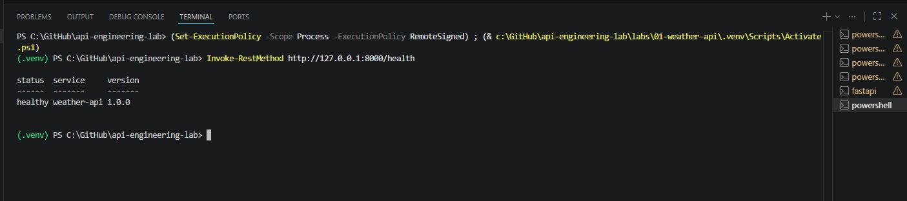


```powershell
Invoke-RestMethod http://127.0.0.1:8000/weather
```

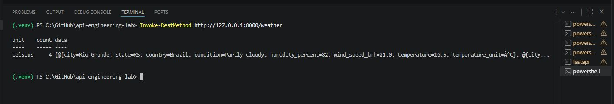


For a city:

```powershell
Invoke-RestMethod "http://127.0.0.1:8000/weather/rio-grande"
```

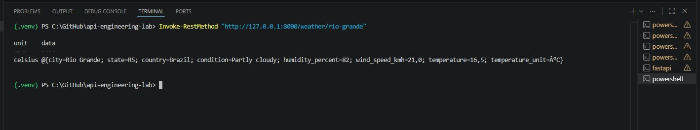


With Fahrenheit:

```powershell
Invoke-RestMethod `
  "http://127.0.0.1:8000/weather/orlando?unit=fahrenheit"
```

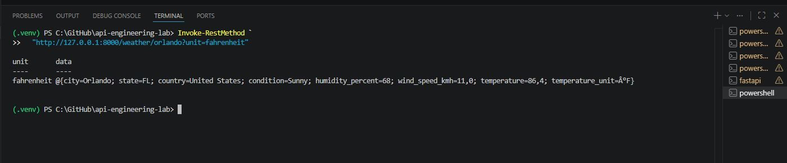


It is also possible to use `curl.exe` on Windows:

```powershell
curl.exe http://127.0.0.1:8000/weather/tampa
```

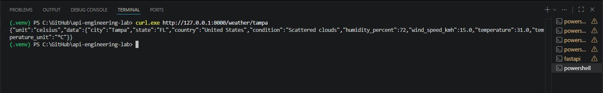


---


## 14. Initial Testing on Postman

The goal will be to arrive at this structure:

```text
Lab 01 — Weather API
├── 01 - API Information
├── 02 - Health Check
├── 03 - List Weather Records
├── 04 - Get Weather by City
├── 05 - Convert Temperature
└── 06 - City Not Found
```

All requests will use the variable:

```text
{{base_url}}
```

with the value:

```http
http://127.0.0.1:8000
```

Using the variable avoids repeating the full address in each request. Postman automatically replaces `{{base_url}}` with the value defined in the collection.

Create a collection named:

```text
Lab 01 — Weather API
```

Add the requests:

```http
01 - API Information
GET {{base_url}}/

02 - Health Check
GET {{base_url}}/health

03 - List Weather Records
GET {{base_url}}/weather

04 - Get Weather by City
GET {{base_url}}/weather/rio-grande

05 - Convert Temperature
GET {{base_url}}/weather/orlando?unit=fahrenheit

06 - City Not Found
GET {{base_url}}/weather/chicago
```

Create a collection variable:

```http
base_url = http://127.0.0.1:8000
```

In this first lab, Postman will be used at a basic level. Collections, environments, scripts, and Newman will be covered in greater depth later in Labs 07–09.


## Before opening Postman

The API needs to be running while you perform the tests.

### Open the project in VS Code

```powershell
cd C:\GitHub\api-engineering-lab\labs\01-weather-api
```

Activate the virtual environment, if it is not already activated:

```powershell
.\.venv\Scripts\Activate.ps1
```

Then, start the API:

```powershell
uvicorn app.main:app --reload
```

Depending on the structure used in the laboratory, the command can also be:

```powershell
uvicorn main:app --reload
```

Use exactly the command that worked in the previous steps.

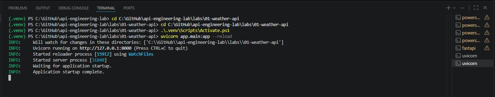


### Confirm that the API is active

The terminal should show something similar to:

```text
Uvicorn running on http://127.0.0.1:8000
```

Test in the browser:

```http
http://127.0.0.1:8000/docs
```

If the Swagger UI documentation opens, the API is ready.

> [!TIP]
> **Note:**
>
> Do not close this terminal while using Postman. The server needs to keep running.
>

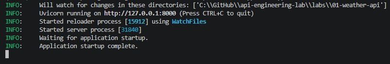


## Rename the collection

On your current screen, the collection appears as "New Collection."

### Rename the collection via the central area

On the screen shown in the image:

1. Click directly on the large "New Collection" title in the center of the screen.
2. Delete the current name.
3. Type:

```text
Lab 01 — Weather API
```

4. Press **Enter**.

After that, the sidebar should show:

```text
COLLECTIONS
└── Lab 01 — Weather API
```

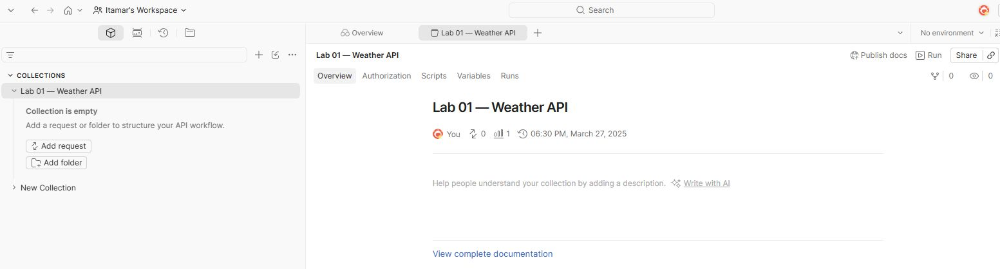

A **collection** is a grouping of saved requests. In addition to requests, it can contain variables, documentation, examples, and test scripts.


### Create the `base_url` variable

In the image, you can already see the tabs:

```text
Overview | Authorization | Scripts | Variables | Runs
```

or:

```text
Variable | Type | Value
```

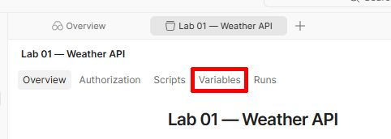


### Register the variable

In the first empty line, fill in:

### Variable

```text
base_url
```

### Type

Keep:

```text
default
```

### Initial value or Shared value

```text
http://127.0.0.1:8000
```

### Current value or Local value

```text
http://127.0.0.1:8000
```

If there is only one column named **Value**, enter the following in it:

```text
http://127.0.0.1:8000
```

The result should be similar to:

```Markdown

| Variable   | Type    | Initial/Shared value    | Current/Local value     |
| ---------- | ------- | ----------------------- | ----------------------- |
| `base_url` | default | `http://127.0.0.1:8000` | `http://127.0.0.1:8000` |

```

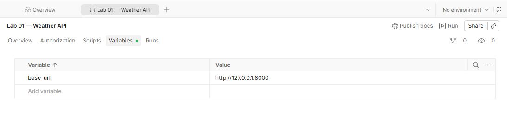


### Save the change

Look for the **Save** button, usually in the top-right corner, and click it.

In some recent versions, Postman saves certain changes automatically. Even so, when **Save** appears, use it.

### Do not create an environment at this time

In the top-right corner of your image, the following appears:

```text
No environment
```

This does not represent an error.

In this lab, we are creating a `collection variable`, not an environment variable. Therefore, you can leave it as is:

```text
No environment
```

The difference is:

- **Collection variable**: belongs only to the `Lab 01 — Weather API` collection.
- **Environment variable**: belongs to an environment, such as `Local`, `Development`, or `Production`.

Since we only have a local API in this lab, the collection variable is sufficient.


### Create your first request

### Click Add request

In the left sidebar, below `Collection is empty`, click:

```text
Add request
```

A new request tab will open.

You will see something like this:

```http
GET | Enter URL or paste text | Send
```

### Configure the first request

Keep the method as:

```http
GET
```

In the URL field, enter:

```http
{{base_url}}/
```

Note that there is a forward slash `/` after the double braces.

When the variable is configured correctly, Postman typically displays `base_url` in a different color. Hovering your mouse over the variable may show the resolved value:

```http
http://127.0.0.1:8000
```

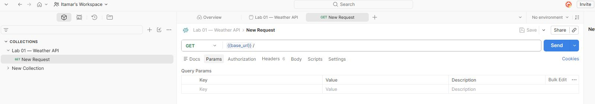


### Save the request

Click **Save** or press:

```text
Ctrl + S
```

In the save window:

1. For the request name, enter:

```text
01 - API Information
```

2. Confirm that the destination is:

```text
Lab 01 — Weather API
```

3. Click **Save**.


### Send the request

Click the **Send** button.

At the bottom of the screen, Postman should display:

- HTTP code;
- response time;
- response size;
- response body;
- headers.

You should see:

```text
200 OK
```

And a JSON body containing API information. The exact content depends on the code created in the lab.

Postman recognizes JSON responses and typically displays the content already formatted and with syntax highlighting.


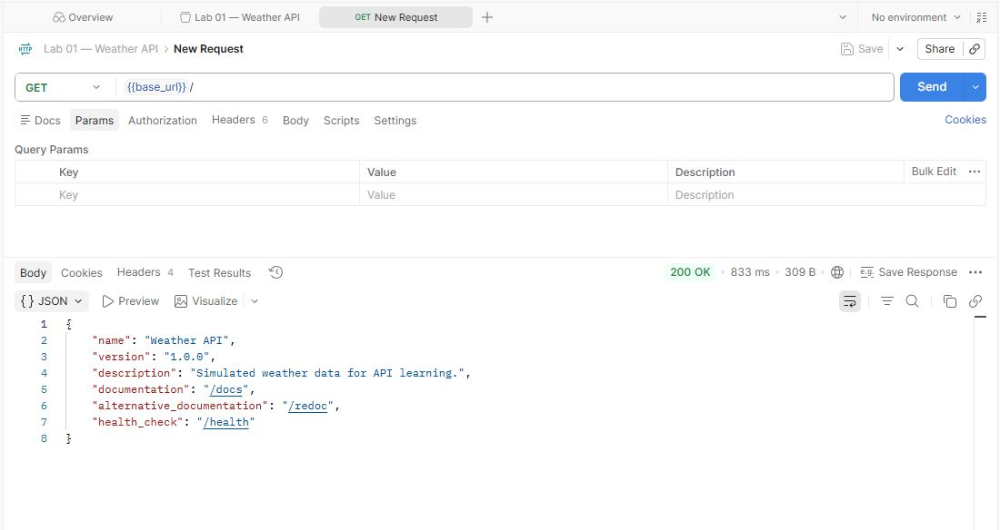


