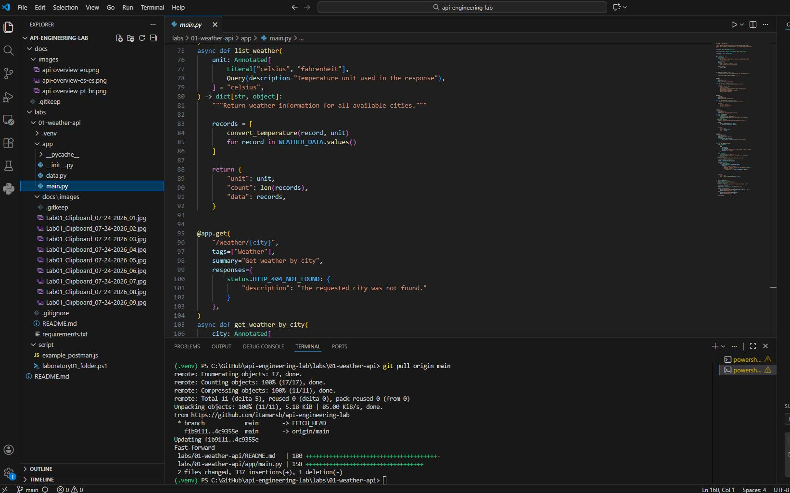
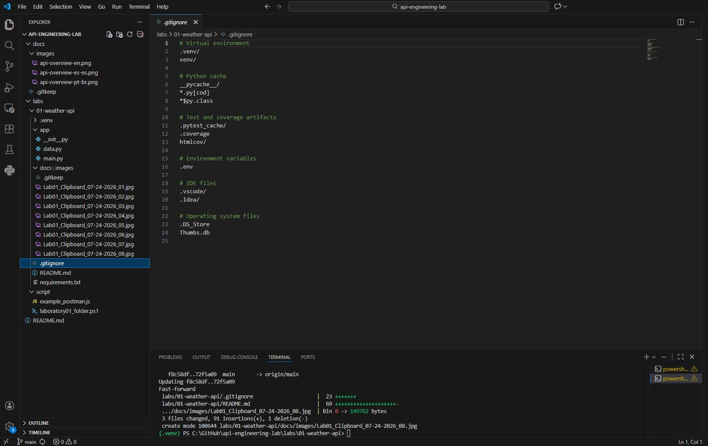
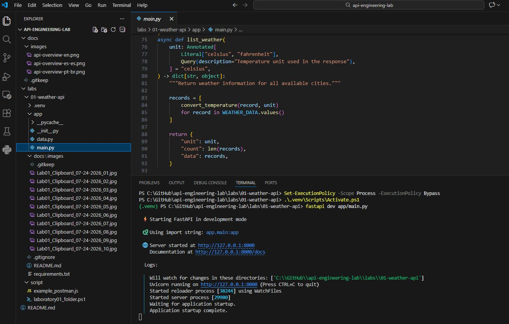
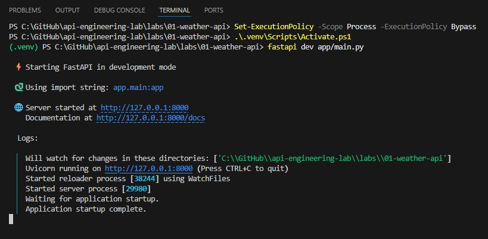
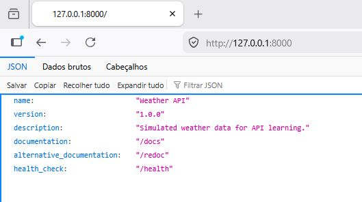

# Lab 01 — Weather API

### Scope of this first version

We will implement four endpoints:

```http
GET /
GET /health
GET /weather
GET /weather/{city}
```

They will demonstrate:

- creating a FastAPI application;
- HTTP GET operations;
- JSON responses;
- path parameters;
- query parameters;
- HTTP status codes;
- handling non-existent cities;
- automatic documentation with Swagger UI and ReDoc;
- local execution;
- manual testing via browser, Swagger, PowerShell, and Postman.

FastAPI automatically distinguishes between parameters present in the path and those received in the query string. Type annotations are also used for conversion, validation, and OpenAPI contract generation.

---

## 1. Laboratory structure

Within the repository, we will create:

```text
api-engineering-lab/
│
├── labs/
│   └── 01-weather-api/
│       ├── app/
│       │   ├── __init__.py
│       │   ├── data.py
│       │   └── main.py
│       │
│       ├── docs/
│       │   └── images/
│       │
│       ├── .gitignore
│       ├── README.md
│       └── requirements.txt
│
└── README.md
```

For Lab 01, this structure offers a good balance: it is small enough to grasp (especially if you are a beginner following the tutorial in this repository), yet it avoids concentrating the entire project into a single file.

---

## 2. Create the lab folder

In the VS Code integrated terminal, run the following from the repository root:

### PowerShell

```powershell
mkdir labs\01-weather-api
mkdir labs\01-weather-api\app
mkdir labs\01-weather-api\docs
mkdir labs\01-weather-api\docs\images

New-Item labs\01-weather-api\app\__init__.py -ItemType File
New-Item labs\01-weather-api\app\data.py -ItemType File
New-Item labs\01-weather-api\app\main.py -ItemType File
New-Item labs\01-weather-api\requirements.txt -ItemType File
New-Item labs\01-weather-api\.gitignore -ItemType File
New-Item labs\01-weather-api\README.md -ItemType File

cd labs\01-weather-api
```

It is also possible to create these folders manually using the VS Code Explorer.


AND


---


## 3. Create the virtual environment

Inside `labs/01-weather-api`, run:

```powershell
python -m venv .venv
```

The `venv` creates an isolated environment so that the lab's dependencies do not mix with global packages or other Python projects. The name `.venv` is a common convention for this directory.


Activate the environment:

```powershell
.venv\Scripts\Activate.ps1
```

When active, the terminal should display something similar to:

```powershell
(.venv) PS C:\...\api-engineering-lab\labs\01-weather-api>
```

However, if PowerShell blocks the activation, run it only for the current session:

```powershell
Set-ExecutionPolicy -Scope Process -ExecutionPolicy Bypass
```

Then, try again:

```powershell
.venv\Scripts\Activate.ps1
```


---


## 4. Install FastAPI

Populate the `requirements.txt` file with:

```text
fastapi[standard]
```


Then run:

```powershell
python -m pip install --upgrade pip
pip install -r requirements.txt
```

The `fastapi[standard]` installation includes the standard dependencies required to run the application and provides the FastAPI CLI. Current documentation recommends working within a virtual environment and running the application in development mode using `fastapi dev`.


Once we confirm that everything is working, we can pin the installed versions:

```powershell
pip freeze > requirements.txt
```

This makes future execution more reproducible. The FastAPI documentation itself recommends pinning a version that has been validated by the project, especially before evolving or publishing the application.


> [!TIP]
> **Note:**
>
> If you are new to FastAPI, I suggest you take some time to review the official FastAPI documentation (at the link below), as there is no better material for learning any technology than the official documentation provided by the developers themselves:
>
> https://fastapi.tiangolo.com/
> 


---


## 5. Create the simulated weather data

In the file:

```text
app/data.py
```

add:

```python
"""Simulated weather data used by the Weather API."""

WEATHER_DATA: dict[str, dict[str, object]] = {
    "rio-grande": {
        "city": "Rio Grande",
        "state": "RS",
        "country": "Brazil",
        "temperature_c": 16.5,
        "condition": "Partly cloudy",
        "humidity_percent": 82,
        "wind_speed_kmh": 21.0,
    },
    "porto-alegre": {
        "city": "Porto Alegre",
        "state": "RS",
        "country": "Brazil",
        "temperature_c": 19.8,
        "condition": "Cloudy",
        "humidity_percent": 76,
        "wind_speed_kmh": 13.0,
    },
    "orlando": {
        "city": "Orlando",
        "state": "FL",
        "country": "United States",
        "temperature_c": 30.2,
        "condition": "Sunny",
        "humidity_percent": 68,
        "wind_speed_kmh": 11.0,
    },
    "tampa": {
        "city": "Tampa",
        "state": "FL",
        "country": "United States",
        "temperature_c": 31.0,
        "condition": "Scattered clouds",
        "humidity_percent": 72,
        "wind_speed_kmh": 15.0,
    },
}
```

This data is deliberately simulated. We will not need:

- an API key;
- registration with an external service;
- an internet connection;
- handling of request limits;
- third-party dependencies.


The goal of this lab is to learn the structure and behavior of an API, not to integrate a real weather provider. That type of integration will be demonstrated later in another lab.


---


## 6. Build the application

In the file:

```text
app/main.py
```

add:

```python
"""Lab 01 - Weather API.

A small FastAPI application created to demonstrate HTTP, REST, JSON,
routing, path parameters, query parameters and automatic API documentation.
"""

from typing import Annotated, Literal

from fastapi import FastAPI, HTTPException, Path, Query, status

from app.data import WEATHER_DATA


app = FastAPI(
    title="Weather API",
    description=(
        "An introductory REST API that returns simulated weather data "
        "for selected cities."
    ),
    version="1.0.0",
    contact={
        "name": "Itamar de Sá Britto Júnior",
        "url": "https://github.com/itamarsb",
    },
    license_info={
        "name": "MIT",
    },
)


def normalize_city(city: str) -> str:
    """Convert a city name into the key format used by the dataset."""

    return city.strip().lower().replace(" ", "-")


@app.get(
    "/",
    tags=["General"],
    summary="Display API information",
)
async def root() -> dict[str, str]:
    """Return basic information and documentation links."""

    return {
        "name": "Weather API",
        "version": "1.0.0",
        "description": "Simulated weather data for API learning.",
        "documentation": "/docs",
        "alternative_documentation": "/redoc",
        "health_check": "/health",
    }


@app.get(
    "/health",
    tags=["General"],
    summary="Check API availability",
)
async def health_check() -> dict[str, str]:
    """Return the current operational status of the API."""

    return {
        "status": "healthy",
        "service": "weather-api",
        "version": "1.0.0",
    }


@app.get(
    "/weather",
    tags=["Weather"],
    summary="List available weather records",
)
async def list_weather(
    unit: Annotated[
        Literal["celsius", "fahrenheit"],
        Query(description="Temperature unit used in the response"),
    ] = "celsius",
) -> dict[str, object]:
    """Return weather information for all available cities."""

    records = [
        convert_temperature(record, unit)
        for record in WEATHER_DATA.values()
    ]

    return {
        "unit": unit,
        "count": len(records),
        "data": records,
    }


@app.get(
    "/weather/{city}",
    tags=["Weather"],
    summary="Get weather by city",
    responses={
        status.HTTP_404_NOT_FOUND: {
            "description": "The requested city was not found."
        }
    },
)
async def get_weather_by_city(
    city: Annotated[
        str,
        Path(
            min_length=2,
            max_length=80,
            description="City name, such as Rio Grande, Orlando or Tampa",
            examples=["Rio Grande"],
        ),
    ],
    unit: Annotated[
        Literal["celsius", "fahrenheit"],
        Query(description="Temperature unit used in the response"),
    ] = "celsius",
) -> dict[str, object]:
    """Return simulated weather information for one city."""

    city_key = normalize_city(city)
    weather = WEATHER_DATA.get(city_key)

    if weather is None:
        raise HTTPException(
            status_code=status.HTTP_404_NOT_FOUND,
            detail={
                "error": "city_not_found",
                "message": f"Weather data is not available for '{city}'.",
                "available_cities": [
                    item["city"] for item in WEATHER_DATA.values()
                ],
            },
        )

    return {
        "unit": unit,
        "data": convert_temperature(weather, unit),
    }


def convert_temperature(
    weather: dict[str, object],
    unit: Literal["celsius", "fahrenheit"],
) -> dict[str, object]:
    """Return a copy of a weather record using the selected unit."""

    result = dict(weather)
    temperature_c = float(result.pop("temperature_c"))

    if unit == "fahrenheit":
        result["temperature"] = round((temperature_c * 9 / 5) + 32, 1)
        result["temperature_unit"] = "°F"
    else:
        result["temperature"] = temperature_c
        result["temperature_unit"] = "°C"

    return result
```


### What this code already demonstrates:

The endpoint:

```http
GET /weather/{city}
```

uses `city` as path parameter:

```http
GET /weather/orlando
```

While `unit` is a query parameter:

```http
GET /weather/orlando?unit=fahrenheit
```

FastAPI identifies these parameters based on the route declaration and the function signature. It also applies validations and includes the information in the OpenAPI documentation.





---


## 7. Create the .gitignore

In the file:

```text
.gitignore
```

add:

```gitignore
# Virtual environment
.venv/
venv/

# Python cache
__pycache__/
*.py[cod]
*$py.class

# Test and coverage artifacts
.pytest_cache/
.coverage
htmlcov/

# Environment variables
.env

# IDE files
.vscode/
.idea/

# Operating system files
.DS_Store
Thumbs.db
```

The `.venv` folder should not be pushed to GitHub. The repository will store dependencies in `requirements.txt`, not a full copy of the Python environment.




---


## 8. Run the API

In the `labs/01-weather-api` folder, with the virtual environment activated:

```powershell
fastapi dev app/main.py
```

The output should indicate a server similar to:

```http
FastAPI  Starting development server

Server started at http://127.0.0.1:8000
Documentation at http://127.0.0.1:8000/docs
```




The `fastapi dev` command is intended for local development and starts the server with automatic reloading.

It is also possible to run it using:

```powershell
uvicorn app.main:app --reload
```

However, we will use `fastapi dev app/main.py` in the tutorial because it is the workflow currently presented in the official documentation.




---


## 9. Test in the browser

Open:

```http
http://127.0.0.1:8000/
```

Expected response:

```json
{
  "name": "Weather API",
  "version": "1.0.0",
  "description": "Simulated weather data for API learning.",
  "documentation": "/docs",
  "alternative_documentation": "/redoc",
  "health_check": "/health"
}
```




Try this too:

```http
http://127.0.0.1:8000/health
```


```http
http://127.0.0.1:8000/weather
```


```http
http://127.0.0.1:8000/weather/rio-grande
```


```http
http://127.0.0.1:8000/weather/orlando?unit=fahrenheit
```


